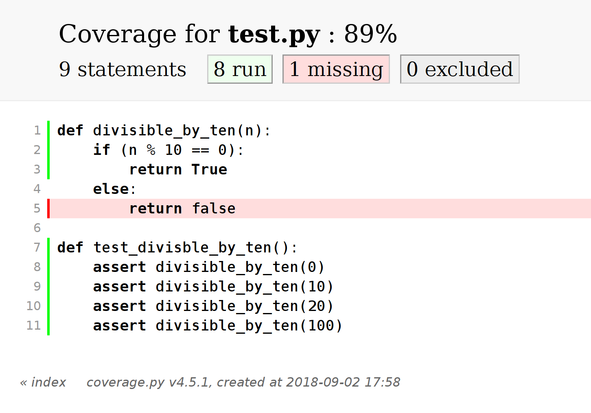

# Intro

## Proč?

- kód testujeme
- testy jsou kód
- ∴ testy testujeme

## A co infrastruktura?

- testovací infrastruktura je taky kód
- kód testujeme
- ∴ infrastrukturu testujeme

# Testování testů samotných

## Zažijte selhání

::: smaller
> "After you have written a test to detect a particular bug, _cause_ the bug
> deliberately and make sure the test complains. This ensures that the test
> will catch the bug if it happens for real."

| The Pragmatic Programmer
| [(Andrew Hunt and David Thomas, 2000)]{.x-smaller}
:::

---

```diff
@@ -544,6 +544,7 @@ class Jenkins(object):
 
   """
   url = '/'.join((item, INFO)).lstrip('/')
+  url = quote(url)
   if query:
     url += query
   try:
```

[python-jenkins, git commit 16007e01](https://git.openstack.org/cgit/openstack/python-jenkins/commit/?id=16007e01858cc5d36afdc31d22b5644f91a1f935)

---

::: smaller
<pre class="python"><code data-line-numbers="|12|12,15-16"
>@patch.object(jenkins.Jenkins, 'jenkins_open')
def test_unsafe_chars(self, jenkins_mock):
  response = build_jobs_list_responses(
    self.jobs_in_unsafe_name_folders, 'http://example.com/')
  jenkins_mock.side_effect = iter(response)

  jobs_info = self.j.get_all_jobs()

  expected_fullnames = [
    u"my_job1", u"my_job2",
    u"my_folder1/my_job3", u"my_folder1/my_job4",
    u"my_folder1/my spaced folder/my job 5"
  ]
  self.assertEqual(len(expected_fullnames), len(jobs_info))
  got_fullnames = [job[u"fullname"] for job in jobs_info]
  self.assertEqual(expected_fullnames, got_fullnames)
</code></pre>
:::

---

::: smaller
```diff
@@ -76,3 +98,11 @@ class JenkinsGetAllJobsTest(JenkinsGetJobsTestBase):
   self.assertEqual(len(expected_fullnames), len(jobs_info))
   got_fullnames = [job[u"fullname"] for job in jobs_info]
   self.assertEqual(expected_fullnames, got_fullnames)
+
+  expected_request_urls = [
+    self.make_url('api/json'),
+    self.make_url('job/my_folder1/api/json'),
+    self.make_url('job/my_folder1/job/my%20spaced%20folder/api/json')
+  ]
+  self.assertEqual(expected_request_urls,
+                   self.got_request_urls(jenkins_mock))
```
:::

## Myslete dlouhodobě

- kód se mění
- testy zastarávají

## Code coverage

::: smaller
> "For example, to have confidence in the testing of a program, we should want
> to know to what extent our tests actually covered the coding. \[…\] a record
> of those areas of coding that have and have not been executed in the course
> of running tests."

| The Psychology of Computer Programming
| [(Gerald M. Weinberg, 1971)]{.x-smaller}
:::

---

:::::: columns
::: {.column width=30%}
měříme, kolik
:::
::: {.column width=30%}
- souborů
- funkcí
- řádků
- větví
- podmínek
:::
::: {.column width=40%}
máme pokryto testy
:::
::::::

---

```python
def divisible_by_ten(n):
    if (n % 10 == 0):
        return True
    else:
        return false

def test_divisble_by_ten():
    assert divisible_by_ten(0)
    assert divisible_by_ten(10)
    assert divisible_by_ten(20)
    assert divisible_by_ten(100)
```

---

{.stretch}

---

(kolik z vás to používá?)

✋

## Mutation testing

- „opravdovější“ code coverage

---

::: smaller
> "If you are _really_ serious about testing, you might want to appoint a
> _project saboteur_. The saboteur's role is to take a separate copy of the
> source tree, introduce bugs on purpose, and verify that the tests will catch
> them."

| The Pragmatic Programmer
| [(Andrew Hunt and David Thomas, 2000)]{.x-smaller}
:::

---

> "Overconfidence by the programmer could be attacked by a system that
> introduced random errors into the program under test."

| The Psychology of Computer Programming
| [(Gerald M. Weinberg, 1971)]{.smaller}

---

::: smaller
<pre class="java"><code data-noescape
>import static org.junit.Assert.assertTrue;
import org.junit.Test;

public class AbsTest {
	private double abs(double x) {
		return x > 0 ? x : -x;
	}

	@Test public void absTest() {
		assertTrue(new Double(1.0d).equals(abs(1.0d)));
		assertTrue(new Double(1.0d).equals(abs(-1.0d)));
		<span class="fragment">assertTrue(new Double(0.0d).equals(abs(0.0d)));</span>
	}
}
</code></pre>
:::

---

(kolik z vás to používá?)

✋

# Testování testovací infrastruktury

## Naše CI infrastruktura

- „velký“ Jenkins
- 1500 jobů z 500 šablon
  ([jenkins-job-builder](https://docs.openstack.org/infra/jenkins-job-builder/))
- tisíce buildů denně
- 20k řádků YAMLů 💩

---

::::::::: xx-smaller
:::::: columns
::: column
```yaml
- job-template:
    name: '{folder}/delivery-promote-packages'
    node: 'simple'
    parameters:
      - choice:
          name: REPO_STAGE
          choices:
              - testing > develop
              - develop > release
              - release > preprod
              - preprod > master
      - text:
          name: REPOSITORIES
          default: …
      - text:
          name: RPMS
          default: ALL
      - bool:
          name: DRY_RUN
      - text:
          name: BLACKLIST
    wrappers:
      - default-wrappers
      - workspace-cleanup
    builders:
      - checkout-ci-infra
      - shell: |
          ci-infra/…/bin/promote-packages.sh
      - promote-notification
```
:::
::: column
```yaml
      - conditional-step:
          condition-kind: and
          condition-operands:
            - condition-kind: strings-match
              condition-string1: '$REPO_STAGE'
              condition-string2:
                'develop > release'
            - condition-kind: strings-match
              condition-string1: '$RPMS'
              condition-string2: 'ALL'
            - condition-kind: not
              condition-operand:
                condition-kind:
                  boolean-expression
                condition-expression: '$DRY_RUN'
          on-evaluation-failure: dont-run
          steps:
            - trigger-builds:
              - project:
                  '{folder}/delivery-promote-packages'
                predefined-parameters: |
                  REPO_STAGE=testing > develop
                  REPOSITORIES=$REPOSITORIES
                  BLACKLIST=ipa.*
    publishers:
      - archive:
          artifacts: '*.log'
          allow-empty: 'true'
```
:::
::::::
:::::::::

---

Jak chcete tohle refaktorovat?

🤕

## Řešení

- většina logiky je v „Execute Shell“ build krocích
- (ano, i spouštění mavenu/gradlu)
- ⇒ dáme tam všechnu a napíšeme unit testy

## Cram

> Cram is a functional testing framework for command line applications. Cram
> tests look like snippets of interactive shell sessions.

<https://bitheap.org/cram/>

---

:::::: columns
::: {.column width=35%}
```shell
my test case::

  $ A=1
  $ echo "$A"
  $ [[ $A == 2 ]]
```
:::
::: {.column .fragment width=65%}
```diff
$ cram --shell=/bin/bash -i a.t
!
--- a.t
+++ a.t.err
@@ -2,4 +2,6 @@

   $ A=1
   $ echo "$A"
+  1
   $ [[ $A == 2 ]]
+  [1]
Accept this change? [yN] y
patching file a.t

# Ran 1 tests, 0 skipped, 1 failed.
```
:::
::::::

---

```shell
my finished test case::

  $ A=1
  $ echo "$A"
  1
  $ [[ $A == 2 ]]
  [1]
```

```shell
$ cram --shell=/bin/bash -i a.t
.
# Ran 1 tests, 0 skipped, 0 failed.
```

## fake

> Fake is a small tool to create test doubles for commandline utilities.

<https://github.com/roman-neuhauser/fake>

---

```shell
  $ . $TESTROOT/setup

  $ hostname -f
  laptop.example.com

  $ fake -o <<<'google.com' hostname -f

  $ hostname -f
  google.com
```

---

```shell
  $ . $TESTROOT/setup

  $ fake -o <<<'localhost' hostname

  $ hostname -f
  fake: error: argv mismatch
  fake: expected: hostname
  fake: received: hostname -f
  [100]
```

---

```shell
  $ . $TESTROOT/setup

  $ fake -c sleep

  $ sleep 1
  $ sleep 2
  $ sleep 5
```

---

```shell
  $ . $TESTROOT/setup

  $ fake -b <<\EOF git clone \
  >   git@github.com:gooddata/repo.git
  > #!/bin/sh
  > mkdir repo
  > touch repo/file
  > EOF

  $ git clone git@github.com:gooddata/repo.git
  $ find repo
  repo
  repo/file
```

## bubblewrap

> Unprivileged sandboxing tool.

<https://github.com/projectatomic/bubblewrap>

---

```shell
$ bwrap \
  --unshare-all \
  --ro-bind / / \
  --proc /proc \
  --dev /dev \
  --tmpfs /tmp \
  rm -rf --no-preserve-root /
```

## cram + fake + bwrap

👍

# 👋

---

<https://store.lisk.in/slides>
